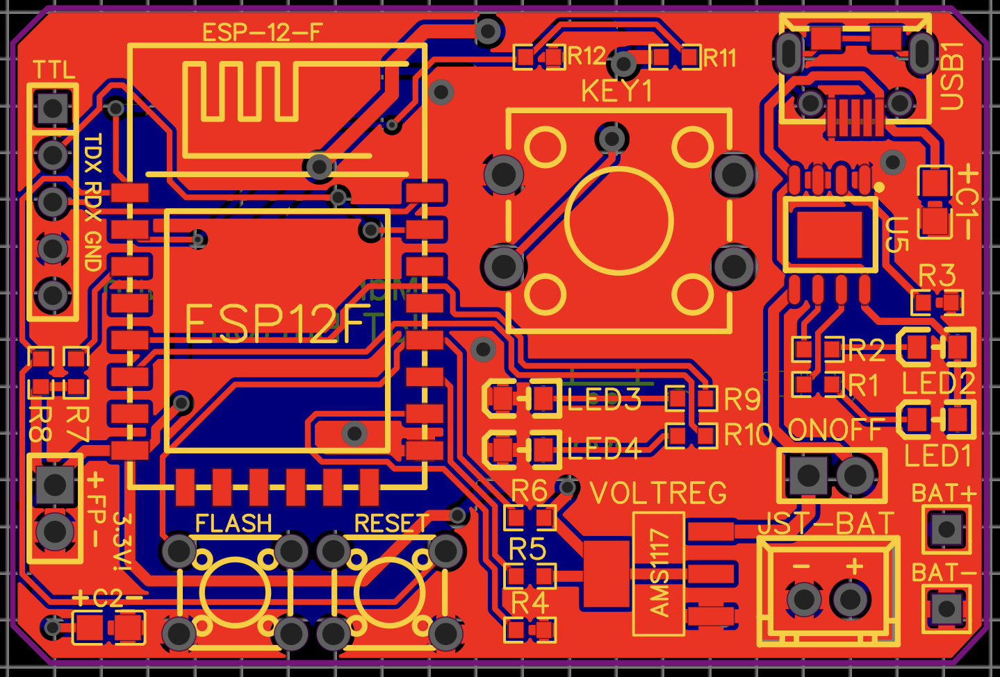

# ESP 8266 12F IoT Button custom PCB

Dieses Projekt enthält:
- Schaltplan
- PCB Design
- Gerber File 
- Beispielcode 

## Funktion
Der ESP wird durch den großen Reset Knopf aus dem Deep Sleep aufgeweckt und sendet Seine Request an einen Webserver, danach geht er wieder in den Deep Sleep (Stromverbrauch ±0,0258mA). Über RTC Memory kann man sich "Flags" trotz Deep Sleep speichern so kann der Controller z.B auch wissen, das wievielte mal er aufgeweckt wurde und dementsprechend anders handeln.

## PCB

Das PCB läuft auf Akku Betrieb. Dieser kann durch anstecken eines Micro USB Kabels geladen werden. Die Bauteilgröße der SMD Teile ist 0805. 
	Die Abmase sind 52,7mm x 35,5mm

Mit dem *TP 4056* wird der Akku geladen. Dieser lädt bis 4,2V, die Geschwindigkeit kann durch den Wiederstand R3 festgelegt werden (R3 = 1k2 => Lädt mit 1000mAh).
Die Status LEDs (LED1 und LED2) zeigen an ob der Akku noch läd (leuchtet rot) oder ob der Akku voll ist (leuchtet Grün).
Siehe dazu auch Tabellen Seite 3 [Datenblatt](https://dlnmh9ip6v2uc.cloudfront.net/datasheets/Prototyping/TP4056.pdf).

Der ESP8266 ist ein 3,3V Microcontroller deshalb regelt ein *AMS 1117* für Konstante 3,3V trotz einer Batteriespannung von bis zu 4,2V

## Flashen
Da der blanke ESP 12F verbaut ist kann nicht über die USB Schnittstelle geflasht werden. Um z.B. über die Arduino IDE zu Flashen einfach CP2102 USB to TTL Modul an die Leisten links neben dem Chip anstecken, externen 3,3V Stromversorgung anschließen. Danach den Boot Modus aktivieren und als ESP8266 12E in der Arduino IDE bespielen.

### Bootmodus Aktivieren
Flash und Reset gleichzeitig drücken und Flash vor Reset wieder loslassen. Danach ist der Chip bespielbar. Wenn der Chip beschrieben wurde einfach erneut Reset Drücken um den Boot Modus zu verlassen.
